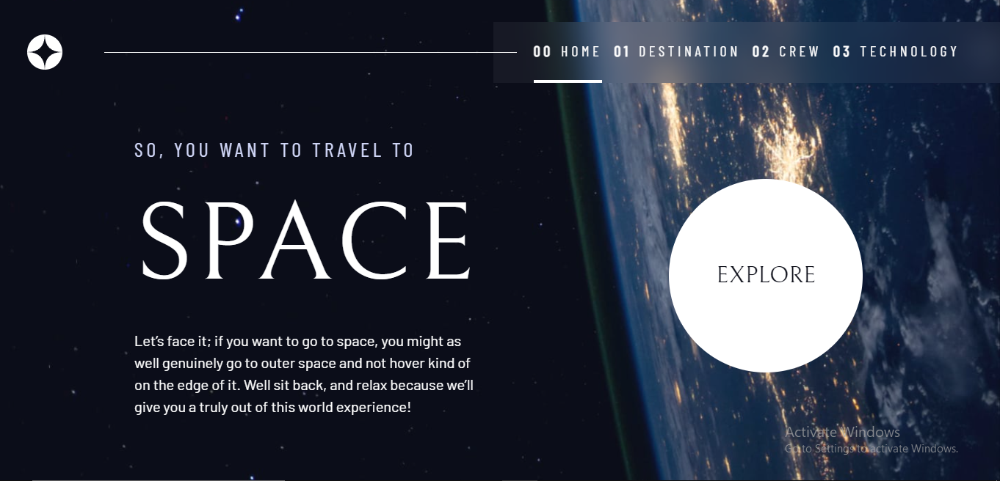

# Frontend Mentor - Space tourism website solution

This is a solution to the [Space tourism website challenge on Frontend Mentor](https://www.frontendmentor.io/challenges/space-tourism-multipage-website-gRWj1URZ3). Frontend Mentor challenges help you improve your coding skills by building realistic projects.

## Table of contents

- [Overview](#overview)
  - [The challenge](#the-challenge)
  - [Screenshot](#screenshot)
  - [Links](#links)
- [My process](#my-process)
  - [Built with](#built-with)
  - [What I learned](#what-i-learned)
  - [Continued development](#continued-development)
  - [Useful resources](#useful-resources)
- [Author](#author)
- [Acknowledgments](#acknowledgments)

## Overview

### The challenge

Users should be able to:

- View the optimal layout for each of the website's pages depending on their device's screen size
- See hover states for all interactive elements on the page
- View each page and be able to toggle between the tabs to see new information

### Screenshot



### Links

- Solution URL: [Add solution URL here](https://your-solution-url.com)
- Live Site URL: [Add live site URL here](https://your-live-site-url.com)

## My process

### Built with

- Semantic HTML5 markup
- CSS custom properties
- Flexbox
- CSS Grid
- Mobile-first workflow
- Design system
- javascript

### What I learned

- I learned how to make the tab system more accessible for screen readers

```html
<div class="dot-indicators flex" role="tablist">
    <div
    aria-selected="true"
    role="tab"
    aria-controls="commander-tab"
    tabindex="0"
    data-image="commander-image"
  ></div>
  <div
    aria-selected="false"
    role="tab"
    aria-controls="specialist-tab"
    tabindex="-1"
    data-image="specialist-image"
  ></div>
  <div
    aria-selected="false"
    role="tab"
    aria-controls="pilot-tab"
    tabindex="-1"
    data-image="pilot-image"
  ></div>
  <div
    aria-selected="false"
    role="tab"
    aria-controls="engineer-tab"
    tabindex="-1"
    data-image="engineer-image"
  ></div>
</div>
  ```

- I created a design system for reuseable components using css to speed up my workflow
the grid container help me arrange content on my page

- I also used SCSS for the first time and a lot of custom properties

```css
.grid-container {
    --gap:2rem;
    display: grid;
    gap: var(--gap, 1rem);
    text-align: center;
    padding:2rem 1.5rem 5rem;
    place-items: center;
    & *{
        max-width: 55ch;
    }

    @media screen and (min-width:45rem) {
        grid-template-columns: minmax(2rem, 1fr) repeat(2, minmax(0, 30rem)) minmax(2rem, 1fr);
        text-align: left;
        .first-content{
            grid-column: 2;
        }
        .second-content{
            grid-column: 3;
        }
    }
}
```

- rather than use classes for the nav, i used the data-visible attribute to make the nav more accessible for screen readers

```js
mobileNavToggle.addEventListener("click", function () {
let visibility = nav.getAttribute("data-visible");
if (visibility === "false") {
  nav.setAttribute("data-visible", true);
  mobileNavToggle.setAttribute("aria-expanded", true);
} else {
  nav.setAttribute("data-visible", false);
  mobileNavToggle.setAttribute("aria-expanded", false);
}
});

}
```

### Continued development

**I want to learn the reactjs library and probably do a lot of projects. Hit me up if you want to collabx

### Useful resources

- [CSS Tricks](https://css-tricks.com/backdrop-filter-effect-with-css/) - This helped with the glass effect of the navbar
and to add support for browsers that do not support this effect

## Author

- Frontend Mentor - [@mastershifu-0](https://www.frontendmentor.io/profile/mastershifu-0)
- Twitter - [@tolahni](https://www.twitter.com/tolahni)

## Acknowledgments

Shoutout to KevinPowell
